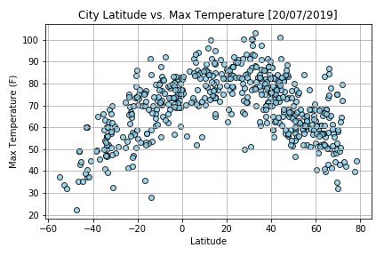

Data observation:
1. Not all lat and long pair has the name of city from citipy.
2. When call API from open weather data, not all city has the current weather data.
3. The cities close to equator have higher max temperature than the other.

